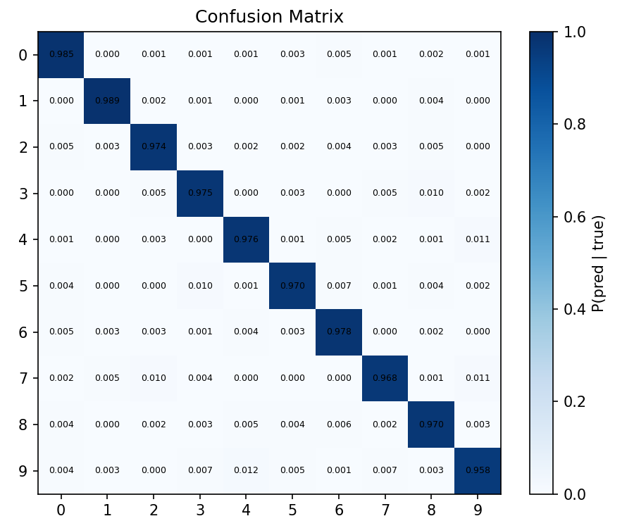
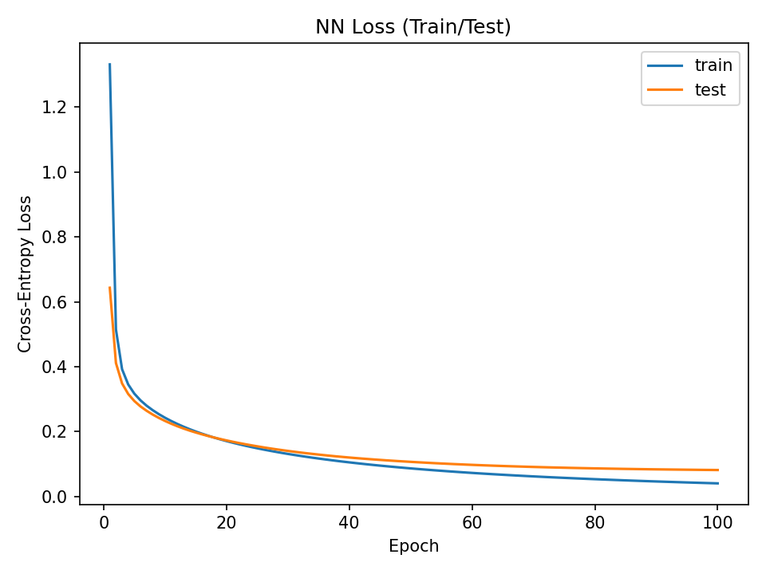

# 3-layer Neural Network for Classification (From Scratch)
This repository contains the implementation of a 3-layer Neural Network (NN) for classification, built entirely from scratch using only Python and standard scientific computing libraries like Numpy. (Also, There are Pytorch implementation.)


<p align="center">
  
  
</p>

<p align="center">
  <em>scratch NN Confusion Matrix of Model Predictions (left), Training and Validation Loss Curves (right)</em>
</p>


## 🎯 Project Objective
The primary goal of this part of the assignment was to build and train a functional 3-layer Neural Network capable of classifying handwritten digits from the MNIST dataset. This implementation focuses on developing a deep understanding of the fundamental building blocks and the training pipeline without relying on external deep learning frameworks.


## 🧱 Network Architecture
The network is a 3-layer structure designed to classify 

28×28 input images into 10 output classes (digits 0-9).

The sequence of the layers is:


Input→Linear→ReLU→Linear→ReLU→Linear→SoftMax


### Implemented Sub-Modules (with Backpropagation)
All sub-modules were implemented with their respective forward and backpropagation methods:


- Linear Layer: Implements the affine transformation (W⋅X+b) and calculates the gradients for weights, biases, and the input.
- ReLU: Implements the non-linear activation function and its derivative.


### Implemented Functions (with Derivatives)
The following functions and their derivatives were implemented to complete the network's forward pass and loss computation:
- SoftMax: Calculates the probability distribution over the 10 classes.
- Cross-Entropy (CE) Loss: Computes the loss, which is the objective function for training.


## ⚙️ Training Pipeline
The training pipeline was implemented following the standard deep learning loop:
1. Data Preparation: Load and prepare the MNIST dataset, including necessary preprocessing like normalization.
2. Model Initialization: Initialize the model parameters (weights and biases).
3. Forward Propagation: Compute the network's output prediction.
4. Loss Computation: Calculate the Cross-Entropy Loss.
5. Backward Propagation: Compute the gradients of the loss with respect to all parameters.
6. Parameter Update: Update the model parameters using the implemented Stochastic Gradient Descent (SGD) optimizer.


```bash
# run# This script runs the training and testing of the neural network model.
python train_NN.py

# Then, it tests the trained model.
python test_NN.py  
```
